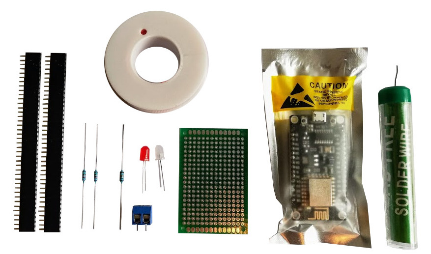
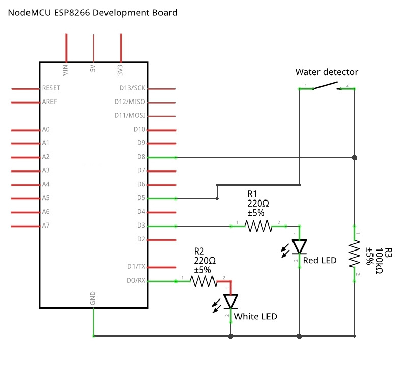

# Water Alarm with Mobile App

Open source hardware and software water alarm with app which notifies you when water is detected.

The hardware for the water alarm consists primarily of a NodeMCU ESP8266 development board, and a makeshift shield that supports the water detecting probe and two status LED. At the time of writing this, the consumable components for building the water alarm hardware costed approximately £8, including post and packaging. It is worth noting however that many of these components cannot be bought as singular items. Although a white LED costs approximately £0.10, you will find it difficult to buy a single white LED.

## App Setup

In order to receive notifications to a device, we will be using [Pushover](https://pushover.net/).

* Navigate to the [pushover website](https://pushover.net/).
* Sign up for an account.
* Create a new application.
* Subscribe to your application.
* Take note of the application API token, and your user token.

You can now install pushover on your device of choice (Android/IOs) and login. You will be on a 7 day free trail for receiving notifications from your new application. Once you have confirmed your water alarm is working, you can use a 1 time purchase to permanently use pushover for receiving notifications on this device (£4.70 at the time or writing).

## Required Parts

### Pictured above (approximately left-to-right);
* Female PCB header x2 (at least 15 sockets in length)
* 220 ohm resistor x2
* 100k ohm resistror
* Solid core wire
* 2 pin screw terminal
* Red LED
* White LED
* Universal circuit board (at least 14 by 20)
* NodeMCU ESP8266 development board
* Solder

### Additionally you will likely need;
* Soldering iron
* Wire cutters
* Wire stripper
* USB to mini USB cable (with data)
* Mini USB power cable
* Small stainless steel sheet (3cm by 6cm should be more than enough)
* Solderless breadboard

## Assembly and Installation

Using the schematic below and a [solderless breadboard](http://wiring.org.co/learning/tutorials/breadboard/), assemble the basic components of the water alarm and connect them up to your NodeMCU ESP8266 development board. Please note, the switch labelled `Water detector` need only be two unconnected loose wires for the time being. When these two loose wires make contact with water a circuit is completed and the alarm will trigger. We will convert them to something more robust when we get to soldering it all down.

Once everything is connected as shown above, you will want to flash the `water-alarm.ino` file in this directory onto your board ready for testing. To do this you will need the [Arduino IDE](https://www.arduino.cc/en/main/software) installed, and you will need to follow the instructions for installing the ESP8266 boards on the IDE in order to flash software onto it. You can find instructions for installing these boards using the `Boards Manager`[here](https://arduino-esp8266.readthedocs.io/en/latest/installing.html#installing).

Once the appropriate ESP8266 boards have been installed in your Arduino IDE;

1. Plug the NodeMCU ESP8266 development board into your computer via USB with data.
2. Open your Arduino IDE (if you have not already).
3. From the toolbar select File > Open and then choose the water-alarm.ino from this directory.
4. From the toolbar select Tools > Port > Your port.
5. Change the `SSID`, `PASSWORD`, `APPLICATION_TOKEN`, and `USER_TOKEN` variables to your own values**.
6. From the toolbar select Sketch > Upload.

> ** The `SSID` is for your wireless connection, `PASSWORD` is the password for your wifi, `APPLICATION_TOKEN` is the API token for your pushover application that you should have set up prior to setting the hardware up, and `USER_TOKEN` is a pushover user or user-group token.  

Once the program has finished uploading to the device, the white LED should start to flash to indicate that is connecting to the WIFI. Once it has connected the white LED should be fully illuminated as long as the connection holds. Touch the two loose wires of the water detector into some water and hold them there for up to 30 seconds. The red LED should illuminate to indicate that water was detected. You should now receive a notification on the device via the Pushover app.
