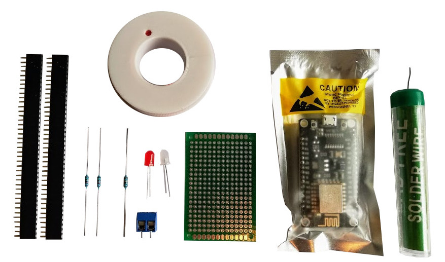

# Required Parts

### Pictured above (approximately left-to-right);
* Female PCB header x2 (at least 8 sockets in length)
* 220 ohm resistor x2
* 100k ohm resistror
* Solid core wire
* 2 pin screw terminal
* Red LED
* White LED
* Universal circuit board (at least 14 by 20)
* NodeMCU ESP8266 development board 
* Solder

### Additionally you will likely need;
* Soldering iron
* Wire cutters
* Wire stripper
* USB to mini USB cable (with data)
* Mini USB power cable
* Small stainless steel sheet (3cm by 6cm should be more than enough) 

